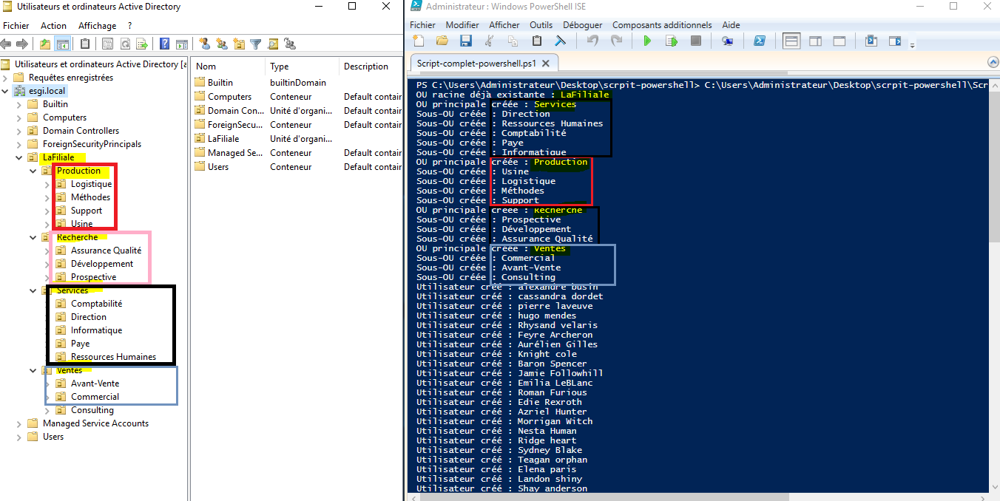

# Projet d’intégration des utilisateurs de LaFiliale dans Active Directory  
**Groupe SRC - Quantalis Innovations**

---

## Contexte

Le groupe **SRC - Quantalis Innovations** est un acteur majeur des services numériques utilisant un annuaire Active Directory sur le domaine **esgi.local**.

Récemment, ce groupe a absorbé une filiale appelée **laFiliale**, opérant dans le même secteur mais ne disposant pas d’Active Directory pour gérer ses utilisateurs.

Le projet consiste à intégrer la structure organisationnelle ainsi que les utilisateurs de **laFiliale** dans l’annuaire Active Directory du groupe SRC. Cela permettra d’homogénéiser la gestion des accès, d’assurer la sécurité des comptes et de simplifier l’administration.

Les Ressources Humaines ont fourni plusieurs fichiers CSV contenant :  
- La structure des unités organisationnelles (OU) à créer.  
- La liste des utilisateurs à intégrer.  
- Une liste d’utilisateurs à supprimer.

---

## Objectifs détaillés

### Script 1 : Création de l’arborescence des unités organisationnelles (OU)

En s’appuyant sur le fichier `OUCreation.csv`, créer récursivement l’arborescence suivante représentant la filiale laFiliale :  

```
LaFiliale (racine)
 ├─ Services
 │  ├─ Direction
 │  ├─ Ressources Humaines
 │  ├─ Comptabilité
 │  ├─ Paye
 │  ├─ Informatique
 ├─ Production
 │  ├─ Usine
 │  ├─ Logistique
 │  ├─ Méthodes
 │  ├─ Support
 ├─ Recherche
 │  ├─ Prospective
 │  ├─ Développement
 │  ├─ Assurance Qualité
 ├─ Ventes
    ├─ Commercial
    ├─ Avant-Vente
    ├─ Consulting
```

Chaque unité organisationnelle doit être créée uniquement si elle n’existe pas déjà dans Active Directory.


Le fichier `OUCreation.csv` doit être adapté pour remplacer noms de domaine **esgi.local** par votre nom de domaine.


---

### Script 2 : Création des utilisateurs dans Active Directory

Le fichier `UsersLafiliale.csv` contient la liste des utilisateurs à intégrer, avec les colonnes :  
- Nom  
- Prénom  
- Téléphone  
- Service (correspondant à l’OU de destination)  
- Fonction (code entier)

Pour chaque utilisateur :  
- Créer un compte dans l’OU correspondant à son service.  
- Générer le `SAMAccountName` sous la forme `nom.prenom` (tout en minuscules).  
- Créer une adresse e-mail au format `nom@lafiliale.com`.  
- Assigner le mot de passe par défaut `Pa55W0rd` avec obligation de changement au prochain login.  
- Ne créer un compte que si celui-ci n’existe pas déjà dans Active Directory.

Avant exécution, assurez-vous que les noms de domaine dans le fichier sont remplacés par **esgi.local** ou par votre nom de domain.



---

### Script 3 : Suppression ciblée d’utilisateurs

Le fichier `usersToSupress.csv` liste les utilisateurs à supprimer, avec la colonne `aSupprimer` indiquant `O` pour suppression.

Le script doit supprimer uniquement ceux marqués par `O`, préalablement à la vérification de leur existence dans Active Directory.

---

### Script 4 : Gestion avancée des utilisateurs et des OUs

Ce script doit réaliser plusieurs tâches :  

1. Désactiver tous les comptes utilisateurs dans les unités organisationnelles :  
   - Direction  
   - Comptabilité  
   - Développement  

2. Vérifier que les utilisateurs suivants sont bien désactivés :  
   - `shiny` dans Direction  
   - `sad` dans Comptabilité  
   - `paris` dans Développement  

3. Supprimer tous les utilisateurs dans l’OU `Usine`, notamment `mendes` et `Human`, puis supprimer cette unité organisationnelle.

4. Effectuer les vérifications nécessaires pour confirmer la suppression et la désactivation correcte.


---

## Conclusion

Ces scripts automatisent l’intégration, la gestion et la sécurisation des comptes utilisateurs dans un contexte de fusion d’entreprise.

```

